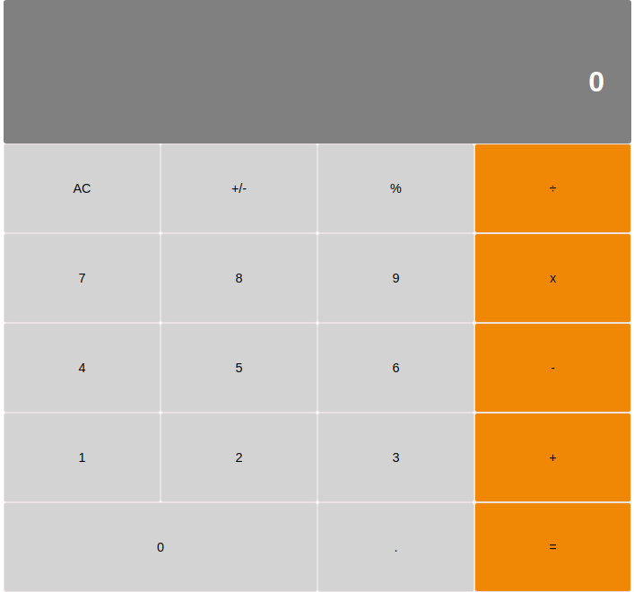

# REACT CALCULATOR

This is a simple calculator built with React by using React classes, it is bootstrapped with [Create React App](https://github.com/facebook/create-react-app).

This project has 5 milestones
- The 1st MileStone: The first step emphasizes on the project setup, by removing the unnecessary files created by the create-react-app, setting up linters for creating error free PRs.
- The 2nd MileStone: Defines the React Components by creating a component folder inside the src folder. Implemented the various components and buttons.
- The 3rd MileStone - The project styling is implemented in this milestone.
- The 4th MileStone - This focuses on the heart of the calculator i.e the logic. Two JavaScript modules were implemented in this milestone: calculate.js and operate.js which will be responsible for all calculations. Finally, these modules were included in the App component so they can be hooked up up to other components in the next milestone.
- The 5th MileStone - This last milestone ties the calculations module with the components and adds the interaction to the buttons. Also, passing event handlers as a props from Parent to Children components.


## Built With
- React
- JSX
- JavaScript ES6
- CSS
- Heroku
- Jest
- React testing library
- ESLINT & STLYELINT

## Getting Started
```
# Clone this repository
$ git clone https://github.com/okikiola11/react-calculator.git

$ cd react-calculator
$ npm start
```

## Live link
Click <a href="https://my-react-ccalculator.herokuapp.com/">My react calculator</a>

## Screenshot


## Available Scripts

Inorder to use the applicaton in the project directory, you can run:

- `npm install`
- `npm start`
- `npm test`
- `npm run build`

## Learn More

You can learn more in the [Create React App documentation](https://facebook.github.io/create-react-app/docs/getting-started).

To learn React, check out the [React documentation](https://reactjs.org/).


## Author

👤 Apelehin Okikiola

- Github: [@okikiola11](https://github.com/okikiola11)
- Twitter: [@Kikiolla3](https://twitter.com/Kikiolla3)
- LinkedIn: [@okikiola-apelehin](https://www.linkedin.com/in/okikiola-apelehin-459008122/)


## 🤝 Contributing
 Contributions, issues and feature requests are welcome!
 -- create an issue <a href="https://github.com/okikiola11/react-calculator/issues">here</a>

## Show your support 
Give a ⭐️ if you like this project!
